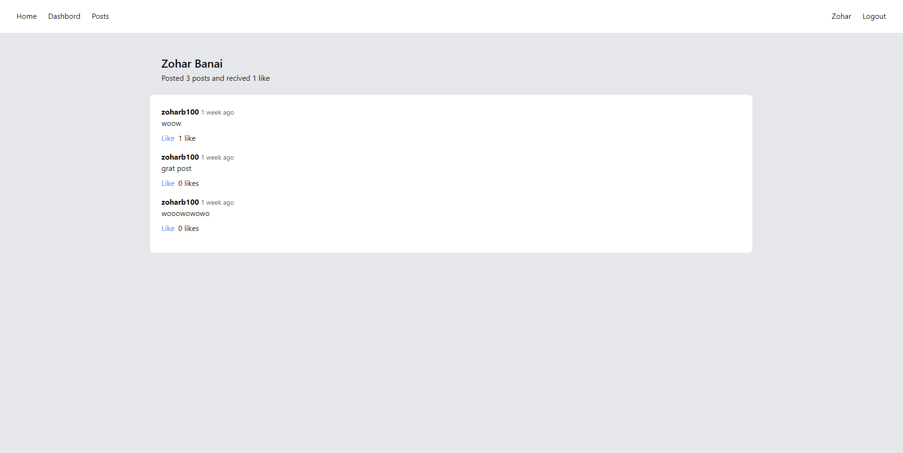
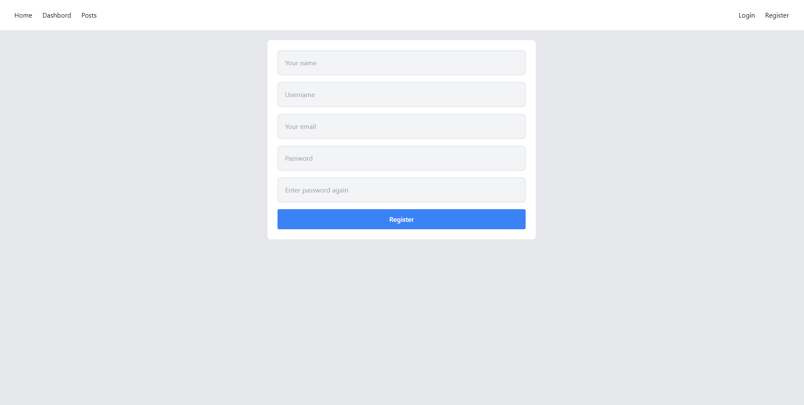
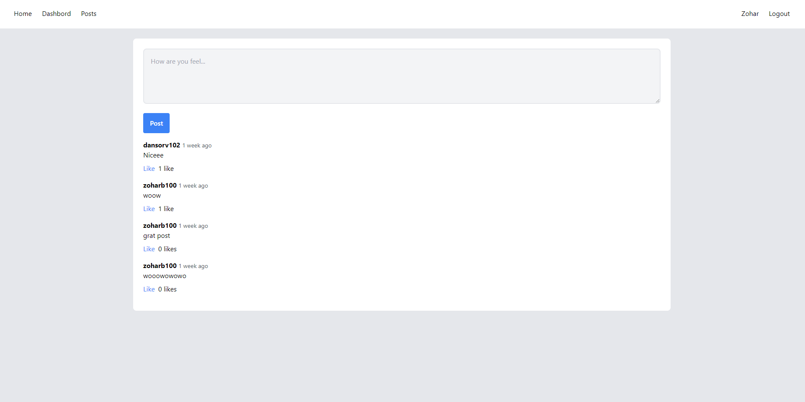

# Street Shop

> Blog platform build for learning purposes, MVC.





## Technologies & Tools

### Front-end:

-   blade
-   JS
-   Taliwind

### Backend:

-   Laravel
-   PHP
-   mailtrap.io

## Features

-   Authentication.
-   Automatic mail sender.
-   Posts.
-   Likes.

## Usage

## Database

create new table format utf8mb4_unicode_ci

### Env Variables

```
cp .env.example .env
```

```
DB_CONNECTION=mysql
DB_HOST=127.0.0.1 (default)
DB_PORT=3306      (default)
DB_DATABASE=(name of the table you create)
DB_USERNAME=root

MAIL_MAILER=smtp
MAIL_HOST=smtp.mailtrap.io
MAIL_PORT=(mailtrap port)
MAIL_USERNAME=(mailtrap username)
MAIL_PASSWORD=(mailtrap password)
MAIL_ENCRYPTION=null
MAIL_FROM_ADDRESS=(your email address)
MAIL_FROM_NAME="${APP_NAME}"
```

## Initial data and tables

run following commands:

```
php artisan migrate

```

## Run

```
composer install
npm install
php artisan serve
```

run on port 8000
